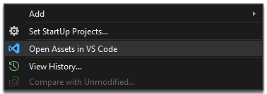

# Open Assets Folder in VS Code
-------------------------------------------------
A Visual Studio extension for easily open solution assets folder in VS Code editor.
If you don't include the assets of your web project to solution, this is totally time saver for you.

See the [changelog](CHANGELOG.md) for updates and roadmap.

## Prerequisite
In order to use this extension, you must have Visual Studio 2015/2017 as well as Visual Studio Code installed.

You can
[download Visual Studio Code](https://code.visualstudio.com/)
for free.

And you must add VS Code executable to the *PATH* environment variable on your OS for enabling VS Code CLI.

Click here to detailed information about
[VS Code CLI](https://code.visualstudio.com/docs/editor/command-line)

### Open assets folder in VS Code

You can open assets folder in Visual Studio Code by simply right-clicking it in Solution Explorer and select Open Assets in VS Code.

## Contribute
Check out the [contribution guidelines](CONTRIBUTING.md)
if you want to contribute to this project.

## License
[MIT](LICENSE)